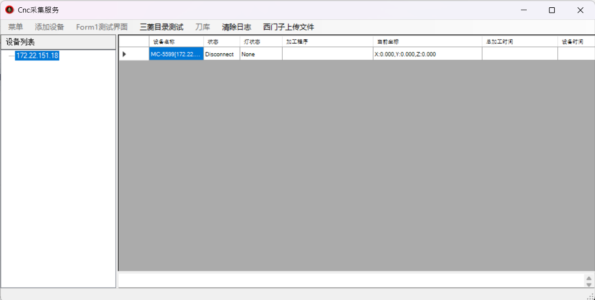
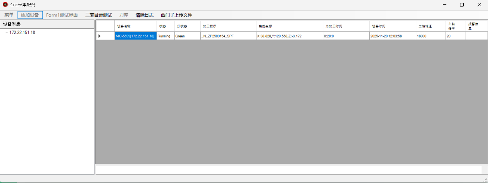
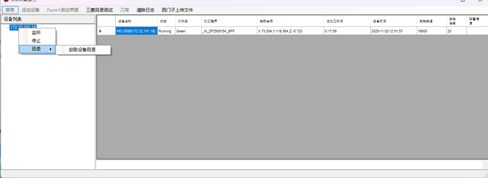
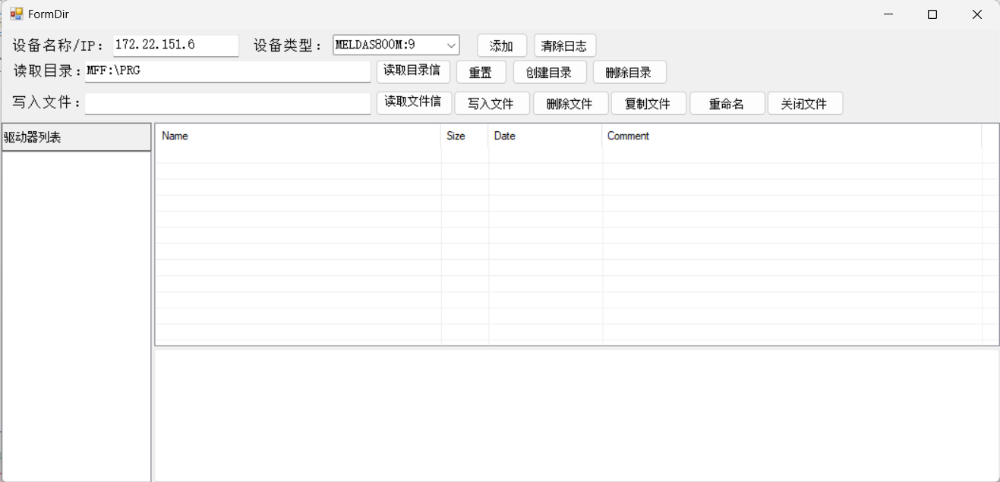
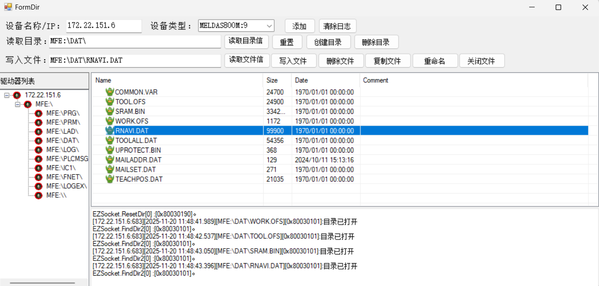
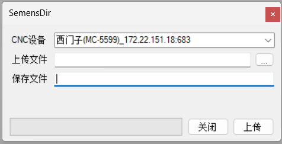

# HmcCncServices

三菱CNC雕刻机通过EZSocketNc信息采集，程序上传，西门子信息通过OPC协议采集程序和上传

## Quickstart
	运行本程序之前：
	1，读取三菱设备：电脑需要安装三菱A2程序，并可以ping通CNC设备
	2，读取西门子设备：西门子CNC需要确保安装OPC本地协议服务

## 界面
**`UI`**

	主界面

  
  
  
  

	三菱设备目录读取

  
  
  

	西门子设备文件上传

  

